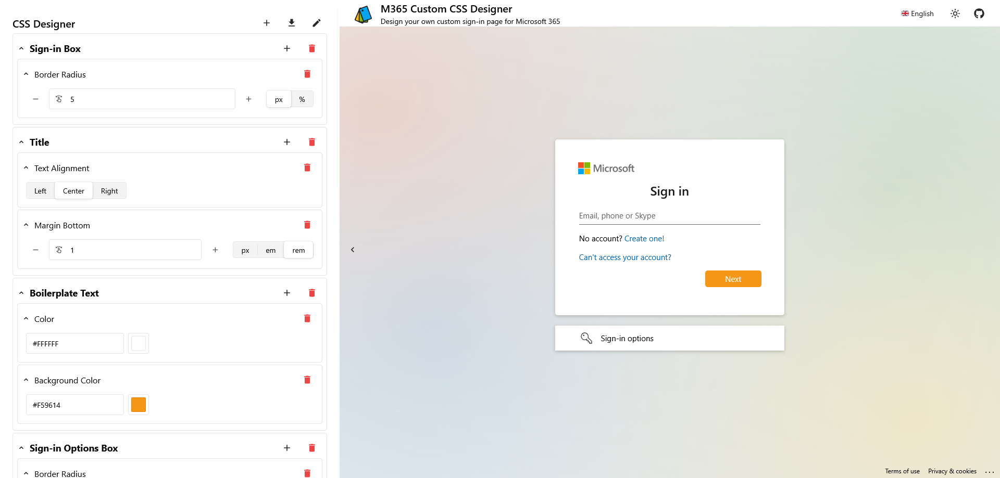

#  M365 Custom CSS Designer

the M365 Custom CSS Designer is a small web application that allows you to visually design [custom CSS for Microsoft's sign-in page](https://learn.microsoft.com/en-us/entra/fundamentals/reference-company-branding-css-template).

|  |
| --------------------------------------- |
| Screenshot of the page                  |

## Why?

because microsoft did not provide any tools for this, only a half-baked documentation.
since i'd guess that most people that'd end up configuring a M365 tenant would not be familiar with CSS, i wanted to create a simple tool that allows you to visually design your custom CSS - making it accessible for everyone.

of course, if you do know your way around CSS, you can switch to the editor view and write your own CSS.

## License

All files except [`src/components/ms`](src/components/ms) are licensed under the [MIT License](LICENSE).
